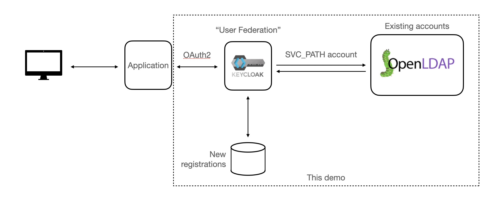

# Keycloak, LDAP, and local user registrations demo



## Running

First generate some self-signed certificates, so that authentication involving keycloak can more realistically
involve TLS (within the docker network):

```
./generate-certs.sh
```

You'll be asked for a passphrase for the signing key and to validate it, and then asked for that key twice more.
The root CA certificate will be in `./rootCA.crt`.

Now fire the keycloak (odic) and LDAP server (ldap) up:

```
docker-compose up -d
```

Once the LDAP service is running (`docker-compose logs ldap_mock` ends with `slapd starting`), 
set up the users in the ldap service - this adds the users in
[ldap_mock/mock_users.ldif](./ldap_mock/mock_users.ldif):

 ```
 ./ldap_mock/config_ldap
 ```

You should get a bunch of lines like `adding new entry "uid=55532dde-dfd6-4811-8ceb-518631f552ee,dc=example,dc=org"`.

When Keycloak up and running (when `docker-compose logs oidc_kc` shows `Admin console listening`), add the realm and users

 ```
 ./oidc/config-oidc-service
 ```

That restarts the IdP and so will take 20 seconds or so.

Once configured, patch the Postgres database to make User's profile `Attributes` `Value` to be `VARCHAR`.

```
./oidc/modify_postgres.sh
```

## Loging in as realm admin

Now log in to the mockrealm admin console with username user1/pass1 at: http://127.0.0.1:8080/auth/admin/mockrealm/console/

## Allowing user registration

Go to the "Realm Settings" and under the "Login" tab, enable user registration.

## Adding the LDAP

Under "User Federation", add an LDAP provider. 

We're going to set the following parameters:

* enabled: ON
* console display name: _whatever you like, 'ldap' is fine_
* import users: OFF
* edit mode: READ_ONLY
* sync registrations: OFF
* vendor: Other
* username LDAP attribute: mail
* RDN LDAP attribute: uid
* UUID LDAP attribute: uid
* User Object Classes: inetOrgPerson
* Connection URL: ldap://ldap:389
* Users DN: `dc=example,dc=org`
* Custom User LDAP Filter: _leave blank_
* Search Scope: One Level
* Bind Type: simple
* Bind DN: `cn=admin,dc=example,dc=org`
* Bind Credential: `admin`

That should be enough; hit "save" and then "Test Connection".  Then hit "Synchronize all users".

## Authenticating against keycloak

With that setup completed, we can now test authentication against keycloak.
There is a client ID/secret setup by the configuration scripts:

* client_ID: mock_login_client
* client_secret: mock_login_secret

and the appropriate endpoints for the client to call can be listed by running

```
 ./oidc/test_scripts/wellknown.sh
 ```

which will output, amongst other things

```
  "authorization_endpoint": "http://localhost:8080/auth/realms/mockrealm/protocol/openid-connect/auth",
  "token_endpoint": "http://localhost:8080/auth/realms/mockrealm/protocol/openid-connect/token",
  "introspection_endpoint": "http://localhost:8080/auth/realms/mockrealm/protocol/openid-connect/token/introspect",
  "userinfo_endpoint": "http://localhost:8080/auth/realms/mockrealm/protocol/openid-connect/userinfo",
  "end_session_endpoint": "http://localhost:8080/auth/realms/mockrealm/protocol/openid-connect/logout",
  "jwks_uri": "http://localhost:8080/auth/realms/mockrealm/protocol/openid-connect/certs",
  ```

Any redirect URL will work with this mock client (a production setup would be more selective)

We can test that we can authenticate with the LDAP users with a
script in `oidc/test_scripts`.  In the config script, the mock login
client has explicitly enabled the resource owner credentials flow,
where rather than the usual "OAuth dance" the user agent simply
provides the username/password directly to the IdP and gets the
token back.  This is almost certainly a bad idea for authentication
in production (where you likely want the Authorization Code flow
with PKCE) but lets us easily test to make sure the authentication
is working.

The LDAP users are in a text file in [ldap_mock/mock_users.ldif](./ldap_mock/mock_users.ldif); let's take
the first

```
dn: uid=347d6cc4-88e0-4264-8f10-bc1699ce89c5,dc=example,dc=org
uid: 347d6cc4-88e0-4264-8f10-bc1699ce89c5
givenName: Billi
sn: Coucher
cn: Billi Coucher
userPassword: tCY8hf5
objectClass: inetOrgPerson
mail: bcoucherd@house.gov
```

And check loging in.  Above we set the username in Keycloak to be the `mail` field, so let's
log in with that username and userPassword: (note URL encoding of email address):

```
./oidc/test_scripts/get_token_any_user.sh bcoucherd%40house.gov tCY8hf5
```

and we should successfully get a token back.  We've authenticated into keycloak with
one of the LDAP users.

From localhost, you can authenticate against keycloak using standard
oauth2/oidc libraries without TLS at http://localhost:8080/auth/realms/mockrealm (run
`./oidc/test_scripts/wellknown.sh` to get the specific endpoints.)

From within the docker-compose network, you can use TLS (with the CA certificate at rootCA.crt) 
using https://oidc:8443/auth/realms/mockrealm/.


## Theme

This repo includes the theme from https://github.com/amanjeev/keycloak-uhn-login-template.
In this case it is automatically mounted to the container. This means that you can use this repo
to play with that theme.

### Activate the theme

1. Log into the admin console after launching the project (see above).
   URL might be http://127.0.0.1:8080/auth
2. Go to the appropriate realm -> Realm settings.
3. Go to the tab Themes.
4. Change the login theme. You should see the theme uhn in the list.